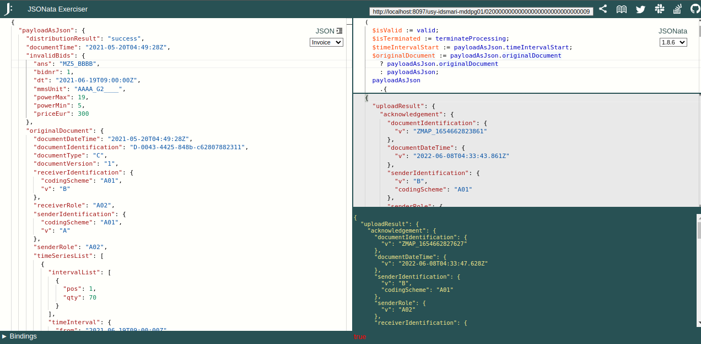

# JSONATA Java Checker

https://try.jsonata.org/

# Install as a User Script - Tampermonkey

1. Add https://tampermonkey.net/ into your browser
2. Install User script from this URL: [jsonata-java-checker.js](https://github.com/petrfilip/jsonata-java-checker-tampermonkey/raw/master/jsonata-java-checker.js)
